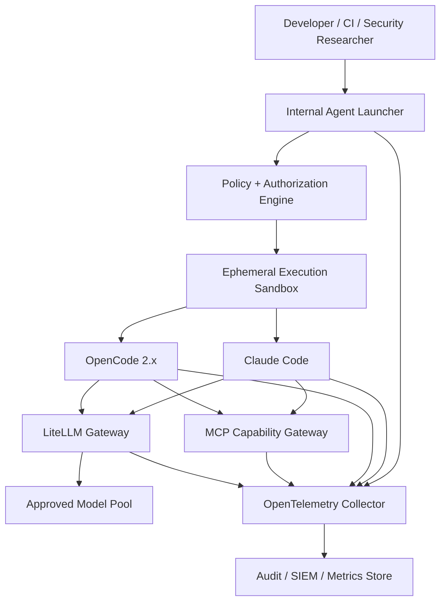
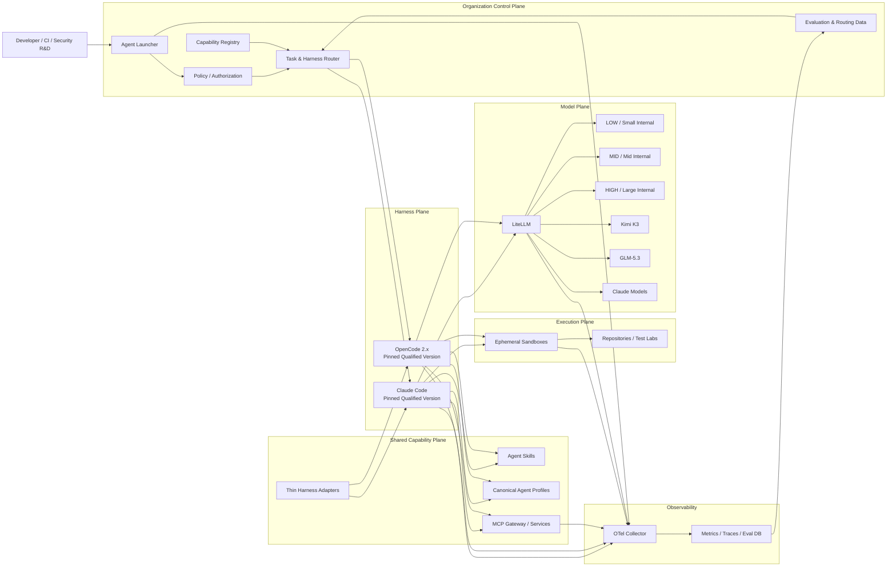
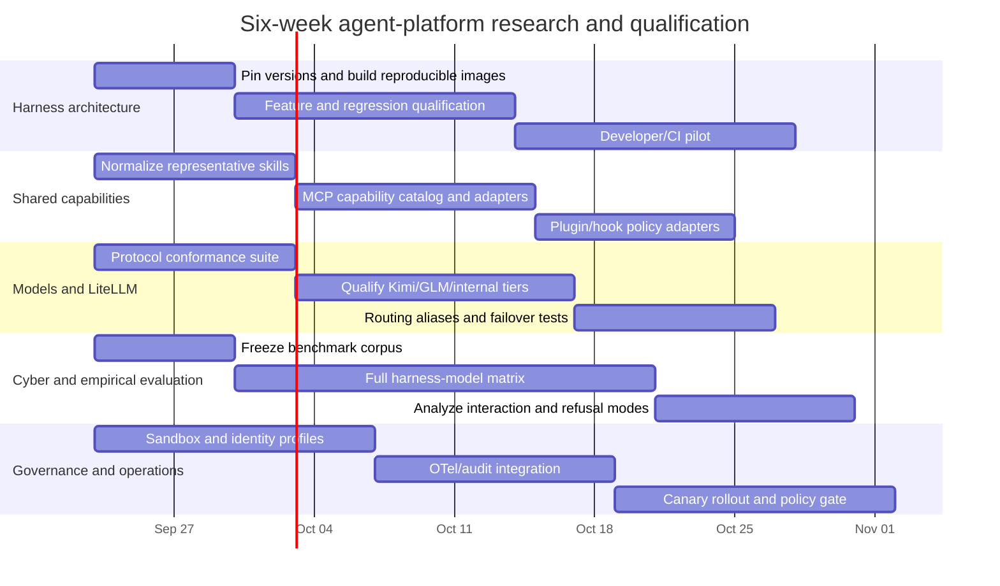

# Claude Code vs. OpenCode 2.x: A Unified AI-Agent Platform for Internal R&D

The uploaded brief specifies the research topic as the design of a unified, high-performance internal AI-agent platform spanning Claude Code, OpenCode 2.x, LiteLLM, internal models, reusable skills/tools, cybersecurity research, governance, observability, and harness×model benchmarking. fileciteturn0file0 The topic is therefore **not actually unspecified**; this report treats its major decision dimensions as five parallel research tracks rather than inventing unrelated health or consumer topics.

**Research date:** September 22, 2026, Asia/Jerusalem.  
**Organization size, deployment footprint, exact internal model IDs, internal infrastructure, compliance regime, budget, benchmark corpus, and current production topology:** unspecified.  
**Bottom-line recommendation:** **do not standardize exclusively on Claude Code or OpenCode 2.x today. Standardize the capability layer, not the harness.** Use Claude Code as the initial default for the most complex coding/security-agent workloads where its orchestration, worktree, hook, sandbox, and enterprise-control stack is advantageous; deploy OpenCode 2.x as a first-class provider-neutral alternative for internal/open models and workloads where forkability, provider control, and protocol extensibility matter. Select both harness and model from an external routing/control plane, backed by internal empirical measurements rather than a permanent hard-coded pairing.

## Executive decision and current-state baseline

As of September 22, 2026, the latest public Claude Code GitHub release I could verify is **v2.1.278**, published September 19, 2026. fileciteturn4file0L1-L2 OpenCode is in an unusual transition state: its repository has tags through **v2.0.12**, whose release commit is dated September 21, 2026, while the same repository also published a v1.18.32 release later on September 21. fileciteturn2file0L1-L3 fileciteturn3file0L1-L2 fileciteturn1file0L1-L2

That version state deserves special attention. The crawled OpenCode V2 documentation still describes itself as a beta that may break or wipe data, says it installs as `opencode2`, and warns that APIs, configuration, and plugin APIs can change, even though the repository now carries 2.0.x tags. citeturn22view0 This is a **documentation/release skew**, not merely cosmetic: it should be treated as migration risk until the organization freezes and qualifies one exact OpenCode commit/tag instead of tracking “latest.”

Claude Code's current gateway documentation is more consequential for this architecture than its version number. Anthropic explicitly documents organizational LLM gateways, `ANTHROPIC_BASE_URL`, per-user gateway credentials, cost/audit centralization, and model discovery from gateways such as LiteLLM; however, Anthropic also explicitly says it **does not support routing Claude Code to non-Claude models through any gateway**. citeturn16view0turn16view0 Claude Code does expose compatibility controls for Anthropic-compatible gateways—including gateway `/v1/models` discovery, context-size overrides, disabling Anthropic-specific beta fields, and forced fine-grained tool streaming—but those mechanisms do not turn arbitrary non-Claude models into a vendor-supported Claude Code configuration. citeturn15search1

OpenCode is structurally almost the inverse. Its V2 documentation presents models/providers as configurable primitives, supports provider/model identifiers, custom agents with per-agent models, and custom provider endpoints; its skills system even directly discovers project and global `.claude/skills` directories. citeturn22view2turn22view3turn22view4 This makes OpenCode the cleaner compatibility target for internal model diversity, while Claude Code is presently the stronger reference implementation for a highly optimized Claude-model coding harness.

The public empirical evidence argues strongly against treating the model as the only performance variable. Wiz's current Cyber Model Arena explicitly evaluates **model+harness pairs** and says the same model can perform substantially differently under different harnesses. Its current indexed results put GLM-5.3 at 58.0% pass@1 overall under Claude Code versus 49.1% under a simple ADK ReAct harness, while Kimi K3 scores 52.2% with ADK ReAct versus 51.0% with Claude Code. citeturn19search0 That direction-changing interaction is precisely why an internal organization should benchmark `(task, harness, model, configuration)` rather than rank models in isolation.

### Decision matrix

| Decision dimension | Claude Code | OpenCode 2.x | Platform implication |
|---|---|---|---|
| Current maturity | Very active 2.1.x product with extensive enterprise docs and controls. fileciteturn4file0L1-L2 | 2.0.x code exists, but public V2 documentation still carries beta/change warnings. fileciteturn2file0L1-L3 citeturn22view0 | Qualify exact versions; never auto-promote latest to production. |
| Non-Claude/internal models | Technically gatewayable through Anthropic-compatible APIs, but non-Claude routing is explicitly unsupported by Anthropic. citeturn16view0turn15search1 | Provider/model neutrality is a core design characteristic. citeturn22view4turn22view3 | Prefer OpenCode for broad internal-model experimentation. |
| Multi-agent orchestration | Strong: subagents, background agents, teams, workflows, worktrees, task coordination. citeturn10view0 | Fresh-context foreground/background subagents and configurable agent profiles; built-in `general` cannot recurse into further subagents. citeturn22view3 | Claude currently has the richer orchestration surface. |
| Skills portability | Agent Skills-style lazy-loading system. citeturn10view1 | Directly reads `.claude/skills`, plus `.opencode/skills`, catalogs and additional sources. citeturn22view2 | A single common skill repository is realistic. |
| MCP | Mature tools/connectors integration. citeturn24view2 | Local stdio + remote Streamable HTTP, OAuth, prompts/resources/tools, long execution timeouts and current MCP protocol negotiation. citeturn23search0 | MCP should be the main cross-harness service boundary. |
| Hooks/plugins | Extremely broad hook lifecycle; organization-enforced hooks and plugin marketplaces. citeturn24view0turn24view1turn24view3 | V2 plugin API can transform tools, sessions, MCP, requests, integrations and more. citeturn23search3 | Keep harness plugins thin; business logic belongs outside them. |
| Execution isolation | Documented sandboxed Bash plus enterprise process/network controls. citeturn16view4turn16view1 | Permission layer is useful, but should not be treated as the primary OS sandbox. citeturn22view5 | External hardened sandbox must be the common denominator. |
| Observability | Native OpenTelemetry monitoring surface plus detailed lifecycle hooks. citeturn16view2turn24view0 | Rich plugin/event surfaces, but public evidence for native end-to-end OTel parity is weaker. citeturn23search3 | Normalize telemetry above/below the harness. |
| Forkability | Public repository, but GitHub reports no repository license metadata; do not assume MIT-style fork rights. fileciteturn6file0L1-L2 | Explicit MIT license; repository currently reports about 209k stars and 27.6k forks. fileciteturn5file0L1-L2 | OpenCode gives substantially more source-level control. |
| Recommended production role | Default high-complexity/high-assurance harness initially | First-class internal/open-model and experimentation harness | Dual-harness, one shared platform |

## Harness architecture, feature parity, and engineering ergonomics

**Track executive summary.** Claude Code is no longer simply a terminal loop around a model: its documented surface includes subagents, background agents, experimental agent teams, worktrees, workflows, checkpointing, MCP, plugins, skills, a very broad hook lifecycle, enterprise policy, sandboxing, web/remote execution, headless operation, and OpenTelemetry. citeturn10view0turn24view0turn16view2 OpenCode V2 is more explicitly composable around providers, agents, a client/server architecture, MCP, skills and plugins, but V2's release/documentation transition makes its current operational maturity less certain. citeturn22view0turn22view3turn23search3 For an internal R&D organization, the strongest design is therefore to exploit each harness's native strengths without making either one's configuration format the organization's canonical platform API.

**Key questions.** The important questions are not “which CLI has more features?” but: Which harness has the better agent loop for each task class? Which features materially change success rate? Which features can be represented portably? Which runtime survives large repositories, long sessions and parallel work? Which one is easier to lock down, automate, upgrade and debug?

**Methodology.** This track prioritizes current vendor documentation and repository state over blog comparisons. Features were classified as execution-loop features, orchestration features, context-management features, integration features, governance features, or user-interface conveniences; only the first five classes should influence a platform-standard decision materially.

| Authoritative source | Credibility | Key finding |
|---|---|---|
| [Claude Code parallel-agent documentation](https://code.claude.com/docs/en/agent-teams) | Anthropic primary documentation | Claude supports multiple parallelization patterns including isolated subagents, background sessions, teams and worktree-based workflows; parallelism multiplies token use. citeturn10view0 |
| [Claude Code hooks reference](https://code.claude.com/docs/en/hooks) | Anthropic primary documentation | Hook lifecycle spans session, prompt, tool, subagent, worktree, compaction, model-switch and termination events. citeturn24view0 |
| [OpenCode V2 agents](https://opencode.ai/v2/docs/agents) | OpenCode primary documentation | V2 agents bind prompts, models, permissions and step limits; child agents receive fresh context and may run foreground or background. citeturn22view3 |
| [OpenCode V2 documentation](https://opencode.ai/v2/docs) | OpenCode primary documentation | Public docs still contain beta/change warnings, creating qualification risk despite 2.0.x tags. citeturn22view0 |
| OpenCode GitHub repository metadata | Primary source-code host | Repository is MIT-licensed and extremely active; latest observed metadata showed 209,256 stars and 27,584 forks. fileciteturn5file0L1-L2 |

**Architecture synthesis.** Claude's differentiator is the *integrated execution environment*. Subagents get isolated context; background sessions can survive independently; agent teams can coordinate via shared work; worktrees let parallel sessions edit independently; and hooks can enforce or instrument nearly every meaningful lifecycle transition. citeturn10view0turn24view0 That combination is directly relevant to large migrations, vulnerability research, large-scale review and CI/autonomous coding.

OpenCode's differentiator is *architectural malleability*. Its agent definition lets each profile select a model, permissions, system prompt and step budget; project agents are straightforward Markdown files; and its V2 provider/plugin surfaces give the organization more opportunity to modify model and execution behavior. citeturn22view3turn23search3 An especially important semantic difference is that a custom OpenCode agent's non-empty `system` field replaces the provider-specific base prompt for that agent while project instructions and skills are added separately. citeturn22view3 That is useful for controlled experiments because it lets the organization vary the harness prompt more explicitly.

OpenCode's current weakness is V2 transition risk. Its V2 docs and tagged code are not completely synchronized, while recent V2 issue reports have included configuration/schema and OpenAI-compatible-gateway compatibility regressions. That does not make V2 unsuitable; it means production should use a **pinned, qualified build with regression tests**, not “whatever `latest` resolves to.” citeturn22view0

For day-to-day developer experience, Claude Code currently has the more coherent integrated feature set around Git/worktrees, multi-agent operation, Desktop/remote environments, terminal automation and enterprise configuration. Claude Desktop can run local, remote or SSH sessions; the CLI remains the stronger surface for scripting and agent teams. citeturn13search4 OpenCode's strength is freedom to tailor providers and behavior rather than a more mature enterprise operating environment.

**Gaps and uncertainties.** No public benchmark comprehensively compares current Claude Code v2.1.278 against **OpenCode v2.0.12** on identical repositories, models, prompts, permissions and resource limits. Public OpenCode V2 documentation skew also prevents treating every documented behavior as verified against the exact latest tag. fileciteturn3file0L1-L2 citeturn22view0

**Recommended next step.** Freeze `claude=2.1.278` and `opencode=2.0.12` as the first qualification pair, containerize both, and run the same internal task corpus through them. Upgrade only when the new version clears automated compatibility, security and performance gates.

## Shared skills, plugins, MCP, hooks, and reusable capability design

**Track executive summary.** A single capability repository is technically achievable, but only if the organization chooses the **lowest common semantic layer** rather than trying to make every harness-specific extension portable. OpenCode V2 directly discovers `.claude/skills` in addition to its own skill paths, and both systems lazy-load skill bodies rather than blindly injecting every skill into every prompt. citeturn22view2turn10view1 MCP is the best cross-harness interface for external systems and substantial reusable tooling; skills should carry procedural knowledge, while hooks/plugins should remain thin harness adapters for policy, lifecycle events, UI and telemetry. citeturn24view2turn23search0

**Key questions.** Can one `SKILL.md` run unchanged in both harnesses? Where should scanner, debugger, reverse-engineering and internal-service logic live? Should internal capabilities be packages, MCP servers or native plugins? How do skills reach users without duplication? How can organization policy prevent a marketplace/plugin from becoming an unmanaged code-execution channel?

**Methodology.** I compared discovery rules, lazy-loading semantics, extension boundaries, MCP transports, plugin distribution, permission integration and lifecycle hooks rather than just counting extension mechanisms.

| Authoritative source | Credibility | Key finding |
|---|---|---|
| [Claude Code Skills](https://code.claude.com/docs/en/skills) | Anthropic primary documentation | Skills use `SKILL.md`, progressively disclose their bodies/supporting material, and conform to the Agent Skills model with Claude-specific extensions. citeturn10view1 |
| [OpenCode V2 Skills](https://opencode.ai/v2/docs/skills) | OpenCode primary documentation | OpenCode directly scans `.claude/skills`, `.agents/skills` and `.opencode/skills`; it also supports local paths and HTTP catalogs. citeturn22view2 |
| [Claude Code MCP](https://code.claude.com/docs/en/mcp) | Anthropic primary documentation | MCP is Claude Code's standardized external-tool/service integration layer. citeturn24view2 |
| [OpenCode V2 MCP](https://opencode.ai/v2/docs/mcp-servers) | OpenCode primary documentation | V2 supports local stdio, remote Streamable HTTP, OAuth, prompts/resources/tools, permissions and current protocol negotiation. citeturn23search0 |
| [Claude plugin marketplace](https://code.claude.com/docs/en/plugin-marketplaces) and [OpenCode V2 plugin API](https://opencode.ai/v2/docs/build/plugins) | Both primary | Both can distribute harness-specific functionality, but their plugin contracts differ substantially. citeturn24view3turn23search3 |

**Single-repository answer.** Yes: a large portion of the organization's skill library can live once and be consumed by both harnesses. OpenCode explicitly treats `.claude/skills` as a compatibility source, both globally and per project. citeturn22view2 For maximum portability, keep shared frontmatter to a conservative Agent Skills subset—`name`, `description`, procedural Markdown, and relative supporting files—and do not make core behavior depend on `metadata.opencode/*` or Claude-only invocation controls. OpenCode accepts extra portability metadata without necessarily interpreting it. citeturn22view2

A practical source tree is:

```text
agent-platform/
├── skills/
│   ├── code-review/SKILL.md
│   ├── vuln-triage/SKILL.md
│   ├── reverse-analysis/SKILL.md
│   └── repo-migration/SKILL.md
├── agents/
│   ├── reviewer.md
│   ├── researcher.md
│   └── security-researcher.md
├── mcp/
│   ├── catalog.yaml
│   └── schemas/
├── policies/
│   ├── permissions.yaml
│   └── network.yaml
├── adapters/
│   ├── claude/
│   └── opencode/
└── evals/
    ├── coding/
    ├── cyber/
    └── regression/
```

The deployment process should symlink or generate the common skills into the locations each harness expects. Because OpenCode can consume `.claude/skills` directly, an even simpler transitional option is to make `.claude/skills` the checked-in compatibility location, although a neutral top-level source directory avoids making the internal platform conceptually Claude-owned. citeturn22view2

**MCP-first boundary.** Use MCP when a capability represents a meaningful service or tool boundary: internal knowledge search, vulnerability scanners, artifact stores, issue trackers, CI systems, lab provisioning, decompilers running on a specialist service, threat-intelligence queries, experiment databases, cloud test environments, or organization-specific code search. OpenCode V2's MCP implementation supports local stdio and remote Streamable HTTP, OAuth, prompt/resource/tool discovery, and execution timeouts up to long-running research workloads. citeturn23search0 Claude Code likewise treats MCP as its external-tool integration layer. citeturn24view2

Do **not** force every operation through MCP. File reads, grep, edits and short shell commands are high-frequency loop primitives; wrapping them in remote RPC adds latency, serialization overhead and another failure mode. MCP is most valuable where portability, security boundary, independent deployment, privileged service identity or reuse outweighs call overhead.

**Hooks and plugins.** Claude's hook system is extraordinarily broad: current hooks cover session start/end, prompt submission, permission requests/denials, pre/post tool execution, subagents, tasks, compaction, worktrees, file/config changes, model switches and MCP elicitation. Handlers can be commands, HTTP endpoints, MCP tools, prompts or agents. citeturn24view0 This makes hooks excellent for audit, policy, deterministic validation, secret scanning, pre-commit rules, environment setup and telemetry—but also dangerous as a place to hide business logic.

OpenCode V2 plugins expose comparable control at a different architectural layer, including session, permission, agents, catalog, commands, integrations, MCP and tool/request transformations. citeturn23search3 The organization should therefore build **two thin adapters** around one shared library/service, rather than two independently evolving feature implementations.

**Internal marketplace.** Use a neutral capability catalog as the source of truth:

```text
Capability Registry
   │
   ├── Skill artifact → Claude/OpenCode skill install
   ├── MCP service    → Claude/OpenCode MCP config
   ├── Agent profile  → generated harness-specific agent file
   └── Plugin adapter → Claude plugin / OpenCode plugin package
```

Claude's native plugin marketplace can remain one delivery frontend, while OpenCode's HTTP skill catalogs and package plugins can be another. citeturn24view3turn22view2turn23search3 Neither native marketplace should own the canonical metadata.

**Gaps and uncertainties.** Exact frontmatter parity and plugin contracts will continue to evolve, especially in OpenCode V2. A shared skill can be source-compatible yet still perform differently because the harness advertises it differently, has different built-in tools, or uses a different base prompt. citeturn22view2turn22view3

**Recommended next step.** Migrate ten representative existing skills into the common format, including simple instruction-only skills, script-backed skills and one security/reversing workflow. Test discovery, explicit invocation, automatic selection, supporting-file access, prompt cost and task success under both pinned harnesses before migrating the entire library.

## LiteLLM, internal models, provider compatibility, and routing

**Track executive summary.** LiteLLM is well suited to be the **model gateway and accounting plane**, but it should not be asked to hide every semantic difference between models or harnesses. LiteLLM exposes a centralized gateway with authentication, authorization, spend tracking, virtual keys, logging, retries/fallbacks and multi-provider translation. citeturn13search5turn14search0 OpenCode naturally fits this model because it is provider-oriented; Claude Code can point to an Anthropic-compatible gateway and even discover gateway models, but non-Claude models remain explicitly outside Anthropic's supported configuration. citeturn16view0turn15search1 Therefore the external router should select a **harness first**, then let LiteLLM select a model/deployment within the protocol envelope that harness can safely consume.

**Key questions.** Can the same internal model run correctly under both harnesses? Which Anthropic-specific fields survive LiteLLM translation? Where should LOW/MID/HIGH aliases resolve? Should the model be selected before or during the session? Can fallback change model families without invalidating an in-progress tool conversation? How should internal variants of Kimi K3, GLM-5.3 and smaller local models be qualified?

**Methodology.** This track distinguishes transport compatibility from behavioral compatibility. Passing an API request is only level one; reliable tool schemas, reasoning controls, streaming, prompt caching, compaction, context accounting and model-specific system prompts constitute the real compatibility target.

| Authoritative source | Credibility | Key finding |
|---|---|---|
| [Claude Code LLM gateways](https://code.claude.com/docs/en/llm-gateway) | Anthropic primary documentation | Gateways centralize credentials, audit and switching, but Anthropic explicitly does not support non-Claude models behind Claude Code. citeturn16view0 |
| [Claude Code environment-variable reference](https://code.claude.com/docs/en/env-vars) | Anthropic primary documentation | Supports LiteLLM-compatible model discovery, gateway context overrides, beta disabling, custom body fields and streaming controls. citeturn15search1 |
| [LiteLLM documentation](https://docs.litellm.ai/) | LiteLLM primary documentation | Gateway provides unified multi-provider calls, auth, budgets, retry/fallback, callbacks and translation. citeturn13search5turn14search0 |
| [OpenCode V2 Providers](https://opencode.ai/v2/docs/providers) | OpenCode primary documentation | Provider/model abstraction and custom endpoint support make internal gateways a first-class architecture. citeturn22view4 |
| [Moonshot AI Kimi K3](https://www.moonshot.cn/) and [Z.AI GLM model page](https://autoclaw.z.ai/models/) | Model-vendor primary sources | Kimi K3 is a current 2.8T-parameter, native-multimodal, million-token model; Z.AI describes GLM-5.3 as its flagship for complex engineering/long-horizon agent work. citeturn20search2turn20search4 |

**Protocol compatibility matrix.**

| Capability | Claude Code → LiteLLM → Claude model | Claude Code → LiteLLM → non-Claude model | OpenCode → LiteLLM/internal provider |
|---|---|---|---|
| Basic text | Supported gateway architecture. citeturn16view0 | Often technically possible, but vendor-unsupported. citeturn16view0 | Natural fit. citeturn22view4 |
| Model discovery | `/v1/models` discovery can be enabled for LiteLLM/compatible gateways. citeturn15search1 | Same transport mechanism, but behavior still unsupported. citeturn15search1turn16view0 | Provider/model catalog is native architecture. citeturn22view4 |
| Tool calling | Strong with supported Claude protocol | Must validate schema translation, parallel calls, IDs and streamed tool arguments | Configure capability metadata accurately; validate per model. citeturn22view4 |
| Extended/reasoning fields | Native Claude semantics | High risk of lossy translation/model mismatch | Model/provider-specific variants are explicit. citeturn22view3 |
| Prompt caching | Claude Code understands Anthropic behavior | Gateway/model semantics may differ | Provider-specific; benchmark rather than assume |
| Context window | Native model metadata | Claude offers an override for mismatched gateway models. citeturn15search1 | Explicit model capabilities should be configured |
| Streaming | Fine-grained streaming is supported/controllable through gateway settings. citeturn15search1 | Must test translated stream events | Provider-dependent |
| Anthropic beta headers | Native | Can break strict compatible proxies; Claude provides a switch to remove experimental beta fields. citeturn15search1 | Not a fundamental harness dependency |

The most important architectural conclusion is that **API compatibility is not agent compatibility**. A Kimi or GLM endpoint can accept an Anthropic-shaped request while still interpreting the Claude Code system prompt, tool descriptions, reasoning configuration, stop behavior and context-management decisions differently. Anthropic's explicit non-support statement is strong evidence that this layer should be treated as experimental rather than production-safe merely because LiteLLM returns HTTP 200. citeturn16view0

The reverse is also true: OpenCode's provider neutrality does not guarantee that every model is good at OpenCode's particular loop. An agent profile combines model selection, system prompt and tool permissions, and an overridden OpenCode system prompt can materially change the behavioral environment. citeturn22view3 Model and harness therefore remain a coupled optimization problem.

**Internal model routing design.** Keep organizational aliases such as `LOW`, `MID`, `HIGH`, `CYBER`, or `LONG_CONTEXT` in the **platform routing layer**, not in skill text and not in model-specific configuration checked into every repository. A task request should carry requirements, for example:

```yaml
task:
  class: vulnerability-research
  risk: authorized-lab
  needs:
    tools: true
    long_context: true
    image_input: false
    autonomous_minutes: 45
    network: restricted
```

The control plane resolves that into:

```yaml
decision:
  harness: claude-code
  harness_version: 2.1.278
  model_alias: CYBER_HIGH
  model_deployment: internal-glm-5.3-a
  sandbox_profile: cyber-isolated-v3
  capability_bundle: security-rd-2026.09
```

In production, however, the example `Claude Code + internal GLM-5.3` pairing should be enabled only after its compatibility/evaluation gate passes, because it is outside Anthropic's supported non-Claude configuration. citeturn16view0

LiteLLM should then resolve the chosen model alias to a deployment and handle credentials, budgets, rate limits, retries and telemetry. citeturn13search5 **Do not use LiteLLM to choose the harness**; by the time a request reaches LiteLLM, the client protocol, system prompt and agent loop have already been selected.

**Fallback rules.** Fallback between deployments of the **same qualified model/protocol** is low risk. Fallback between different model families mid-session is higher risk because pending tool calls, reasoning state, cache semantics and context assumptions may not be interchangeable. Prefer session-bound model selection, with cross-family fallback starting a controlled continuation/fork rather than silently swapping underneath an active agent.

**Internal model uncertainty.** Public Kimi K3 and GLM-5.3 products are verifiable: Moonshot introduced Kimi K3 on July 16, 2026 with 2.8T parameters, native multimodality and a million-token context; Z.AI currently positions GLM-5.3 for complex engineering and long-horizon agent tasks. citeturn20search2turn20search4 Whether your organization's internal deployments use identical checkpoints, quantization, context limits, safety tuning, decoding configuration or serving stack is **unspecified and cannot be inferred from those public names**.

**Gaps and uncertainties.** Exact internal endpoint behavior, model weights, throughput, TTFT, accelerator topology, prompt-cache support and safety tuning are unavailable. Those details can reverse a routing decision even when public benchmark rankings favor a model.

**Recommended next step.** Build an automated gateway conformance suite before task benchmarking: text, tool call, parallel tools, streamed tool call, large JSON arguments, error/retry behavior, context exhaustion, compaction, reasoning modes, prompt-cache accounting, cancellation, 30–60 minute session stability and rate-limit failover.

## Harness × model evidence, cybersecurity research, and benchmark design

**Track executive summary.** Public evidence already demonstrates a meaningful harness×model interaction effect, but it does **not** yet answer the most important internal question: how OpenCode 2.0.12 compares with Claude Code 2.1.278 on Kimi K3, GLM-5.3 and your internal model variants. Wiz's current Cyber Model Arena provides unusually relevant evidence because it runs real cyber tasks in isolated containers, scores deterministically and explicitly treats the agent as a harness+model pair. citeturn19search0 Current results show GLM-5.3 benefiting strongly from Claude Code relative to a basic ReAct harness, while Kimi K3 slightly favors that ReAct harness, proving that “better harness” is model-dependent rather than universal. citeturn19search0

**Key questions.** How large is the harness interaction? Does it persist outside cyber tasks? Which model/harness pairs have high false-refusal rates on authorized security work? Is the win caused by prompting, tools, search strategy, context management or execution speed? Does OpenCode V2 close the older observed performance gap? Which pairing optimizes pass rate, wall time, GPU/API cost and human intervention simultaneously?

**Methodology.** For cyber workloads, authoritative benchmark methodology matters more than anecdotal “vibe coding.” Wiz runs challenge/model/harness combinations repeatedly, imposes a fixed runtime, isolates agents in Docker without external resources, and uses deterministic scoring rather than LLM judging. citeturn19search0 Public model-vendor results are useful as secondary calibration, but internal pairwise experiments should determine deployment policy.

| Authoritative source | Credibility | Key finding |
|---|---|---|
| [Wiz Cyber Model Arena](https://www.wiz.io/cyber-model-arena) | Independent security-vendor benchmark, current live leaderboard | Explicitly benchmarks harness×model pairs; current dataset includes code vulnerabilities, API security, Websec CTFs and cloud security. citeturn19search0 |
| [Wiz benchmark introduction](https://www.wiz.io/blog/introducing-ai-cyber-model-arena-a-real-world-benchmark-for-ai-agents-in-cybersec) | Benchmark author methodology | Original suite introduced 257 real-world offensive-security challenges and deterministic evaluation. citeturn19search7 |
| [Moonshot AI Kimi K3](https://www.moonshot.cn/) | Model vendor primary source | Confirms current Kimi K3 generation and intended long-horizon coding/reasoning positioning. citeturn20search2 |
| [Z.AI GLM-5.3](https://autoclaw.z.ai/models/) | Model vendor primary source | Positions GLM-5.3 specifically for complex software engineering and long-horizon agent tasks. citeturn20search4 |
| [ZCode](https://zcode.z.ai/en) | Z.AI harness/product primary source | Z.AI itself describes ZCode as an official harness deeply optimized for GLM-5.3—direct evidence that vendors consider harness tuning material to model performance. citeturn20search5 |

**Current public cross-harness evidence.**

| Model | Harness | Current Wiz pass@1 overall | Interpretation |
|---|---|---:|---|
| GLM-5.3 | Claude Code | **58.0%** | Strong public result for this pairing. citeturn19search0 |
| GLM-5.3 | ADK ReAct | **49.1%** | Same model, 8.9 percentage points below Claude Code in current indexed results. citeturn19search0 |
| Kimi K3 | ADK ReAct | **52.2%** | Slightly stronger of the two current Kimi harnesses. citeturn19search0 |
| Kimi K3 | Claude Code | **51.0%** | 1.2 points below ADK; Claude Code is not universally superior. citeturn19search0 |
| Claude Opus 5 | Claude Code | **71.2%** | One of the strongest current general model/harness pairs in the indexed leaderboard. citeturn19search0 |
| Kimi K3 / GLM-5.3 | OpenCode 2.x | **No current Wiz result found** | Must be measured internally; do not extrapolate. citeturn19search0 |

The current English Wiz leaderboard has evolved from the site's earlier benchmark snapshot. Cached/localized versions still expose older runs that included OpenCode and earlier models; for example, an older snapshot showed Claude Opus 4.6 at 47.6% with Claude Code and 36.8% with OpenCode, and Gemini 3 Pro at 40.6% with Claude Code versus 16.2% with OpenCode. citeturn18view2turn19search1 Those results are useful only as **historical evidence that harness choice can have a large effect**; they must not be treated as current OpenCode 2.x performance because the dataset, harness code and model generations have changed. The live/current indexed English benchmark should be preferred for present rankings. citeturn19search0

**Why the harness can change the result.** The plausible causal variables are substantial:

| Interaction variable | Why it can matter |
|---|---|
| System/base prompt | A model may have been trained or post-trained around a particular agent protocol; OpenCode even permits complete replacement of its provider-specific base prompt. citeturn22view3 |
| Tool schema and descriptions | Different naming/schema conventions alter tool-selection probability and argument correctness. Claude and OpenCode expose materially different native loops. citeturn24view0turn22view3 |
| Search/read strategy | Different file-search primitives and output truncation determine what evidence enters context. |
| Context management | Compaction thresholds and summarization alter long-horizon state. Claude exposes explicit pre/post-compaction hooks. citeturn24view0 |
| Parallelism | Concurrent reads/subagents can improve wall time but increase cost and coordination complexity. Claude exposes parallel agent patterns explicitly. citeturn10view0 |
| Reasoning configuration | A model's preferred reasoning budget/format can interact with wrapper defaults. |
| Gateway translation | Anthropic-format → non-Claude translation can alter fields, caching, tool streams or reasoning semantics. Anthropic explicitly declines support for this configuration. citeturn16view0 |
| Retry/error policy | Tool and stream failures can cause divergent trajectories even with the same model. |
| Safety/refusal behavior | Harness wording and authorization context can influence false refusal or premature task abandonment. |
| Tool latency | A lower-quality reasoning loop can occasionally win simply by completing more useful actions inside a fixed deadline. |

**Cybersecurity operating model.** For authorized security R&D, measure at least three things separately: technical success, **unwarranted refusal/abandonment rate**, and unsafe/out-of-scope behavior. Collapsing those into a single score hides exactly the failure mode the brief is concerned about.

Authorization should be machine-readable and task-scoped:

```text
Authorization Manifest
├── engagement / lab ID
├── target allowlist
├── permitted techniques
├── network boundaries
├── data-handling classification
├── expiration
└── human escalation contact
```

This manifest should enter both the system context and the external execution-policy engine. It should not be used to bypass model safeguards; its purpose is to reduce ambiguity for legitimately authorized tasks while the sandbox independently enforces what can actually be touched.

The agent should execute exploit-development, fuzzing, malware-analysis, reversing and adversarial test workflows only inside an ephemeral, scoped research environment with no ambient corporate credentials, restrictive egress and deterministic artifact capture. Wiz itself runs its benchmark agents in isolated Docker environments without Internet/CVE resources, illustrating the value of controlling the environment rather than relying solely on behavioral prompting. citeturn19search0 For higher-risk internal work, stronger isolation than ordinary Docker may be warranted depending on the threat model.

**Internal benchmark matrix.** Do not build one giant synthetic “AI score.” Report the dimensions independently:

| Dimension | Required measures |
|---|---|
| Correctness | pass@1, pass@3, tests passed, verifier outcome |
| Cyber effectiveness | root-cause identification, exploit/validation success on approved labs, coverage |
| Refusal quality | justified refusal, unjustified refusal, partial abandonment |
| Autonomy | human interventions, clarification requests, successful uninterrupted minutes |
| Efficiency | wall time, model tokens, tool calls, cost or GPU-seconds |
| Context quality | compactions, forgotten constraints, repeated reads |
| Tool reliability | invalid calls, retries, tool-call parse failures |
| Code quality | regression rate, review defects, test coverage change |
| Security | attempted policy violations, blocked calls, secret exposure attempts |
| Operational reliability | crashes, hung streams, gateway errors, recovery success |

Run every important cell at multiple seeds/runs. A minimum useful matrix is:

```text
                         Claude Code       OpenCode 2.x
Kimi K3                  required          required
GLM-5.3                  required          required
Internal large model A   required          required
Internal mid model B     required          required
Internal small model C   required          required
Claude reference model   required          optional/reference
```

Use identical repositories, initial instructions, tool access, network policy, time budgets and verifier logic. Do **not** artificially force identical system prompts: the native harness prompt is part of what is being evaluated. Run a second “controlled prompt” experiment if causal attribution is needed.

**Gaps and uncertainties.** There is currently no public evidence in the sources reviewed that directly benchmarks **Kimi K3 + OpenCode 2.0.12** or **GLM-5.3 + OpenCode 2.0.12** on the current Wiz suite. That missing quadrant is strategically important rather than a footnote.

**Recommended next step.** Reproduce a representative subset of Wiz-style cyber challenges internally, then add organization-specific secure-code review, reverse engineering, fuzzing, cloud misconfiguration and long-horizon vulnerability-investigation tasks. Benchmark the complete harness×model grid before setting any production default.

## Security, policy, observability, operations, and business trade-offs

**Track executive summary.** Permission systems and model safety are not substitutes for an execution sandbox. Claude Code has the stronger documented built-in/enterprise control story today, including a sandboxed Bash tool, managed policy, network settings, corporate process wrappers, credential scrubbing and a large policy-aware hook surface. citeturn16view4turn16view1turn15search1 OpenCode provides useful ordered permissions and can be governed through plugins/policies, but the shared platform should assume neither harness is the ultimate security boundary. citeturn22view5turn23search3 The durable architecture is to enforce security at the launcher, sandbox, MCP/service authorization and gateway layers, while harness-native controls supply defense in depth.

**Key questions.** Which controls are enforceable by administrators? What data leaves the host? Can untrusted repositories alter hooks/plugins? How are model and tool calls correlated across systems? Can internal security agents safely run for hours? What is the long-run maintenance burden of each harness? How much vendor lock-in is acceptable?

**Methodology.** This track prioritizes enforceable controls over UI warnings, distinguishes policy from actual isolation, and evaluates operational ownership in addition to features.

| Authoritative source | Credibility | Key finding |
|---|---|---|
| [Claude sandboxing](https://code.claude.com/docs/en/sandboxing) | Anthropic primary documentation | Claude exposes a dedicated sandboxed Bash design rather than only approval prompts. citeturn16view4 |
| [Claude enterprise network configuration](https://code.claude.com/docs/en/network-config) | Anthropic primary documentation | Supports proxies, CA/mTLS, background-agent configuration and an organization process wrapper for launcher/sandbox controls. citeturn16view1 |
| [Claude monitoring](https://code.claude.com/docs/en/monitoring-usage) | Anthropic primary documentation | Native OpenTelemetry instrumentation is a documented organizational feature. citeturn16view2 |
| [OpenCode V2 permissions](https://opencode.ai/v2/docs/permissions) | OpenCode primary documentation | Permissions are first-class ordered rules around actions/resources, useful for harness-level policy. citeturn22view5 |
| [LiteLLM](https://docs.litellm.ai/) | Gateway primary documentation | Central gateway supplies authentication, authorization, spend limits, retry/fallback and observability callbacks. citeturn13search5turn14search0 |

**Security architecture.** Treat the layers independently:



The launcher owns identity, task authorization, harness version, capability bundle and sandbox profile. The sandbox owns filesystem/process/network containment. MCP services own their own resource authorization. LiteLLM owns model credentials, quotas and routing. The harness remains an **untrusted but controlled orchestrator** rather than the system's root of trust.

Claude's current enterprise surfaces align well with that pattern. Its network documentation explicitly supports mTLS, corporate proxies and `processWrapper`-style launching, and warns that background-agent supervisors have special environment/launcher propagation behavior that must be configured centrally rather than by shell convention. citeturn16view1 It also supports subprocess credential scrubbing, reducing exposure of model/provider credentials to Bash, hooks and local MCP processes. citeturn15search1

Claude hooks can also be centrally constrained: managed settings can restrict execution to administrator-approved hooks and control HTTP-hook destinations. citeturn24view0 That is useful for enterprise deployment because project-level code should not be able to silently install an arbitrary privileged policy hook.

For OpenCode, retain permissions as an important **agent-level policy layer**, but place high-risk security workloads in the same external sandbox used for Claude. citeturn22view5 This also prevents the security architecture from being weakened merely because the router chooses a different harness.

**Closed-network deployments.** Claude Code has documented enterprise networking, custom CA/mTLS and gateway operation, but it still has optional/feature-specific network dependencies that must be tested when building a genuinely isolated deployment. Its network documentation lists hosts used for authentication, updates, plugins, documentation and telemetry, and distinguishes provider/gateway traffic from other feature traffic. citeturn16view1 A closed environment therefore needs a deliberate feature inventory, mirrored artifacts or disabled capabilities—not just a custom model URL.

OpenCode's greater source/provider control is attractive for isolated environments, especially because the repository is MIT-licensed. fileciteturn5file0L1-L2 Its downside is that the organization assumes more responsibility for qualifying fixes, auditing dependencies and potentially maintaining an internal fork.

**Observability model.** Use one correlation identity from launcher to model:

```text
trace_id
 ├── user / service identity
 ├── task_id + authorization_id
 ├── harness + exact version
 ├── session_id
 ├── agent / subagent id
 ├── model alias + actual deployment
 ├── LiteLLM request IDs
 ├── MCP server + tool call IDs
 ├── sandbox command/process IDs
 ├── token/cost/latency
 └── verifier outcome
```

Claude can feed native OTel plus hook events into this model. citeturn16view2turn24view0 LiteLLM already supports observability callbacks and latency/cost tracking. citeturn13search5 OpenCode V2's plugin surface can instrument session/tool/request activity; however, because the public evidence reviewed does not establish native telemetry parity with Claude's OTel surface, treat the OpenCode exporter/adapter as an explicit platform component. citeturn23search3

**Open-source and maintenance trade-off.** OpenCode is unequivocally MIT licensed, with very high visible community activity. fileciteturn5file0L1-L2 Claude Code's repository is also highly active—GitHub currently reports roughly 147.5k stars and 24.1k forks—but the repository API reports no license metadata, so it should not be treated as giving the same source-level modification/forking rights as MIT OpenCode without separate license analysis. fileciteturn6file0L1-L2

That leads to a practical business trade-off:

| Cost/risk | Claude Code | OpenCode 2.x |
|---|---|---|
| Internal platform engineering | Lower for native Claude workflows | Higher initially because V2 must be qualified and possibly patched |
| Model-provider lock-in | Higher behavioral coupling to Claude | Lower |
| Source control/forkability | Lower/legally different from MIT | High, explicit MIT |
| Enterprise controls | Strong current documentation and product surface | More internal assembly likely required |
| Upgrade burden | Vendor handles core implementation, but rapid release cadence still needs regression testing | Organization can patch/fork, but then owns divergence |
| Internal-model freedom | Constrained by unsupported non-Claude configuration | Strong |
| Long-term strategic leverage | Best when Claude remains a central model family | Best when internal/open models are strategically important |

**Gaps and uncertainties.** Regulatory requirements, internal data classifications, approved container/VM technology, retention policy, SIEM, identity provider and procurement constraints were not specified. Those could change the final security architecture but do not change the principle that isolation and authorization must live outside the model/harness.

**Recommended next step.** Define three execution profiles—`developer`, `autonomous-ci`, and `security-rd`—with progressively stricter identity, egress, filesystem, secret, CPU/GPU/time and human-approval controls. Require both harnesses to pass identical containment tests.

## Unified platform architecture, rollout plan, and final recommendation

**Track executive summary.** The target state should expose one internal **agent platform** while treating Claude Code and OpenCode as interchangeable-but-not-identical execution engines. Developers should consume common skills, agent roles, MCP tools and model aliases without caring which repository contains the provider-specific plumbing. The routing layer should remain conservative at first—static policies informed by benchmark results—and become dynamic only after enough harness×model telemetry exists to support reliable decisions.

**Key questions.** What becomes canonical? Where is routing performed? How do upgrades happen safely? How is performance learned over time? Which harness should be the default before the benchmark dataset is mature?

**Methodology.** The proposed architecture is derived from the cross-track findings: keep portable semantics above the harness, tool/service logic beside it through MCP, model access below it through LiteLLM, and execution security around it through a launcher/sandbox.

| Authoritative source | Credibility | Architectural implication |
|---|---|---|
| Claude gateway documentation | Anthropic primary | Gateway belongs beneath the harness; it does not make Claude Code harness-neutral. citeturn16view0 |
| OpenCode V2 skill discovery | OpenCode primary | Shared Claude-compatible skill source is technically possible. citeturn22view2 |
| Claude + OpenCode MCP docs | Both primary | MCP is the clearest shared service/tool abstraction. citeturn24view2turn23search0 |
| LiteLLM gateway docs | Primary | Central model policy, credentials, budgets, retries and observability belong at the gateway. citeturn13search5 |
| Wiz Cyber Model Arena | Independent benchmark | Harness must be part of routing/evaluation because performance is pair-specific. citeturn19search0 |

**Recommended target architecture.**



**Canonical ownership should be:**

| Object | Source of truth | Harness adapters |
|---|---|---|
| Procedural skills | Neutral Agent Skills repository | Installation/symlink + optional metadata |
| Agent intent/role | Canonical agent schema | Generated Claude subagent/OpenCode agent files |
| External tools | MCP service catalog | Harness MCP configuration |
| Business logic | Independent library/service | Thin plugin/hook wrapper only |
| Permissions | Organization policy schema | Claude managed settings/hooks + OpenCode permissions/policies |
| Model aliases | Routing service/LiteLLM config | Harness sees qualified aliases/model IDs |
| Harness choice | Launcher/router | Never delegated to LiteLLM |
| Model deployment | LiteLLM/router | Session-bound resolution |
| Sandbox | External execution platform | Harness launched inside it |
| Telemetry | Organization OTel/eval schema | Harness and gateway exporters |

**Routing policy at launch.** Before internal data exists, use an intentionally conservative policy:

```text
Complex coding / migration / cross-repo reasoning
    → Claude Code + best qualified high-tier model

Authorized cyber R&D
    → best measured harness×model pair for task subtype
    → isolated security-rd sandbox

Internal/open model experimentation
    → OpenCode 2.x by default
    → LiteLLM/internal provider

Fast/simple code tasks
    → whichever harness×small-model cell meets SLO at lowest cost

Unknown task
    → default qualified harness
    → record outcome for routing dataset
```

Claude Code should be the **initial default**, not because it receives a permanent universal score, but because the current evidence base demonstrates a richer mature orchestration/policy surface and strong public harness results while OpenCode 2.x is still exhibiting release/documentation transition risk. citeturn10view0turn24view0turn22view0 OpenCode should simultaneously be production-qualified for internal models because it is materially more provider-neutral and MIT-forkable. citeturn22view4 fileciteturn5file0L1-L2

**Do not immediately deploy an ML task router.** Start with transparent rules. Once hundreds or thousands of internally scored runs exist, fit a routing model on features such as repository size, language, task class, required capabilities, historical model success, refusal risk, estimated context, deadline and cost budget. Keep a deterministic override for regulated/security-sensitive workloads.

### Parallel research and implementation timeline

The five tracks can fit into a six-week qualification program without waiting for one track to finish before another starts.



**Milestone gates.**

At the end of the first two weeks, the organization should have exact pinned harness images, a gateway conformance suite, a first portable skill set, a common sandbox, and a frozen benchmark corpus. By approximately week four it should have enough paired runs to know whether current OpenCode V2 is competitive with Claude Code for Kimi K3, GLM-5.3 and internal models. By week six it should be able to set evidence-backed defaults and canary the shared launcher.

No promotion should occur merely because a version is newer. Each harness release should pass:

```text
install/startup
→ configuration/schema validation
→ skill discovery
→ MCP connectivity
→ model gateway conformance
→ tool-use regression
→ sandbox containment
→ telemetry completeness
→ benchmark smoke suite
→ canary
→ production
```

### Final recommended operating model

**Standardize these things organization-wide:** capability IDs, skill format, MCP service contracts, authorization manifests, sandbox profiles, task/evaluation schemas, model aliases, traces and launcher UX.

**Do not standardize these things prematurely:** one harness, one model family, one harness-native plugin framework, or one vendor's agent-definition syntax.

**Claude Code role:** primary high-assurance harness initially; reference baseline for sophisticated coding/orchestration and a particularly important candidate for cyber work. Its strongest advantages are the depth of the agent lifecycle, parallel/worktree workflows, enterprise hooks and controls, sandbox/network integration and the sheer maturity of the Claude-optimized agent loop. citeturn10view0turn24view0turn16view1

**OpenCode 2.x role:** first-class alternative and experimentation platform; preferred starting point when internal/open model freedom, custom protocol behavior, deep source modification or vendor independence matters. Its most strategically valuable properties are provider neutrality, direct compatibility with `.claude/skills`, broad V2 plugin/MCP surfaces and MIT licensing. citeturn22view2turn22view4turn23search3 fileciteturn5file0L1-L2

**LiteLLM role:** model access, identity, quotas, accounting, deployment-level routing, retries/failover and shared telemetry—not a magic compatibility layer and not the harness router. citeturn13search5turn16view0

**MCP role:** default reusable integration boundary for substantial internal capabilities. Use native local file/shell tools when latency and high call frequency dominate; use skills for procedural instructions; use plugins/hooks only where the harness lifecycle itself must be altered. citeturn24view2turn23search0turn24view0

**Dynamic routing role:** make it the target state, but only after internal benchmark data exists. Wiz's current evidence demonstrates why: GLM-5.3 gains materially under Claude Code relative to ADK ReAct, while Kimi K3 slightly moves the other way. A routing policy that knows only “which model is strongest?” is therefore fundamentally under-specified. citeturn19search0

The strategic conclusion is consequently **“one platform, multiple harnesses, multiple models.”** Claude Code and OpenCode should become execution backends behind the organization's own stable control plane. That design captures Claude Code's current orchestration and enterprise strengths, OpenCode's provider/forkability advantages, and LiteLLM's model-gateway leverage without turning any of those components into an architectural point of no return.